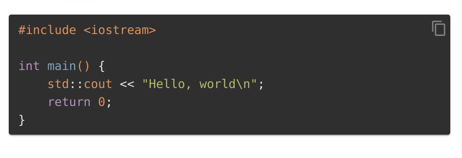

# markdown-it-code-copy

A markdown-it plugin to add a copy icon in code blocks to copy the code.

## Screenshots




## Installation

```
npm i markdown-it-code-copy
```


## Usage

Make sure the corresponding icon font is installed
(default is [material-design-icons](https://dev.materialdesignicons.com/getting-started/webfont)).

```js
const md = require('markdown-it')()
	.use(require('markdown-it-code-copy'), {
		// Options
	});
```

### Options

| Name      | Default                          | Description            |
| --------- | -------------------------------- | ---------------------- |
| iconStyle | 'font-size: 21px; opacity: 0.4;' | The style of copy icon |
| iconClass | 'mdi mdi-content-copy' | The class of copy icon |
| buttonStyle | 'position: absolute; top: 7.5px; right: 6px; cursor: pointer; outline: none;' | The style of the button wrapper |
| buttonClass | '' | The class of the button wrapper |

**Tips**:
If you want to use a different icon font,
change the icon class and make sure the corresponding icon font is installed.

## License

MIT License
